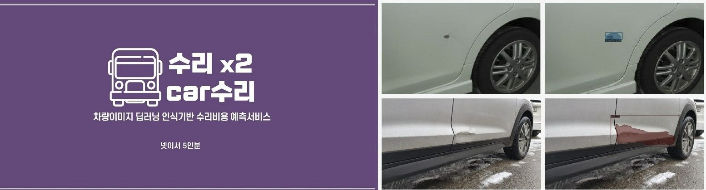
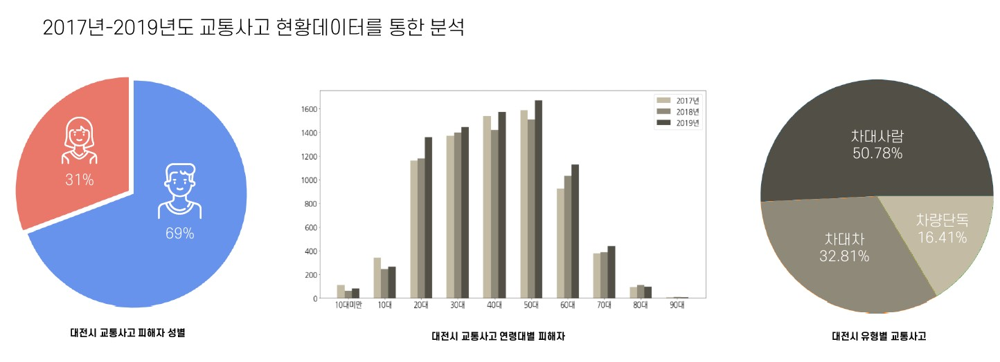

# 팀프로젝트

### 프로젝트 목적: 
자동차의 손상된 부위 (스크레치/찌그러짐)에 대한 이미지를 학습한 모델을 활용하여, 추후 자동차 손상된 부위를 분류하고 해당 부위의 넓이를 도출하여 단위 면적당 자동차 수리비용을 예측하는 프로젝트 진행. 

### 프로젝트 요약: <[PPT 보기](https://github.com/Hanbi-Kim/Data-Analysis-Projects/blob/main/%ED%8C%80%ED%94%84%EB%A1%9C%EC%A0%9D%ED%8A%B8_%EC%B9%B4%EC%88%98%EB%A6%AC/%EC%88%98%EB%A6%AC%EC%88%98%EB%A6%AC%EC%B9%B4%EC%88%98%EB%A6%AC.pdf)>
1. Python Library Selenium/BeautifulSoup을 통한 구글 차량 손상 이미지 크롤링
2. 이미지의 손상 부위 및 손상 종류에 대한 Labelling 작업
3. 딥러닝 Resnet / Eddynet을 활용한 모델링 
4. Bootstrap/Flask를 활용한 웹프로그래밍 서비스 기획 작업 

     
# COMPAS 데이터 분석 공모전

[COMPAS](https://compas.lh.or.kr/)에서 주관한 경진대회 참여 목록 및 코드 정리 목록
1. [대전시 교통사고 위험지역 도출](https://compas.lh.or.kr/subj/past/info?subjNo=SBJ_2102_003)
<[최종 보고서 보기](https://github.com/Hanbi-Kim/Data-Analysis-Projects/blob/main/COMPAS/%EB%8C%80%EC%A0%84%EC%8B%9C%EA%B5%90%ED%86%B5%EC%82%AC%EA%B3%A0%EC%98%88%EC%B8%A1/%EB%8C%80%EC%A0%84%EC%8B%9C%20%EA%B5%90%ED%86%B5%EC%82%AC%EA%B3%A0%20%EC%9C%84%ED%97%98%EC%A7%80%EC%97%AD%20%EB%8F%84%EC%B6%9C%20%EC%B5%9C%EC%A2%85%EB%B3%B4%EA%B3%A0%EC%84%9C_%EC%99%84%EB%A3%8C(PDF).pdf)>

    

# Dacon 데이터 분석 공모전
[Dacon](https://dacon.io/)에서 주관한 경진대회 참여 목록 및 코드 정리 목록

1. [뉴스 토픽 분류 AI 경진대회](https://dacon.io/competitions/official/235747/overview/description)
<[코드 정리 보기](https://github.com/Hanbi-Kim/Data-Analysis-Projects/blob/main/Dacon/%EB%89%B4%EC%8A%A4%20%ED%86%A0%ED%94%BD%20%EB%B6%84%EB%A5%98%20AI/DL_LSTM.ipynb)>

2. [제 2회 컴퓨터 비전 학습 경진대회](https://dacon.io/competitions/official/235697/overview/description)
<[코드 정리 보기](https://github.com/Hanbi-Kim/Data-Analysis-Projects/blob/main/Dacon/%EC%BB%B4%ED%93%A8%ED%84%B0%20%EB%B9%84%EC%A0%84%20%ED%95%99%EC%8A%B5/Dacon_Computer_Vision_%EC%B5%9C%EC%A2%85%ED%8C%8C%EC%9D%BC.ipynb)>

3. [운동 동작 분류 AI 경진대회](https://dacon.io/competitions/official/235689/overview/description)
<[코드 정리 보기](https://github.com/Hanbi-Kim/Data-Analysis-Projects/blob/main/Dacon/%EC%9A%B4%EB%8F%99%20%EB%8F%99%EC%9E%91%20%EB%B6%84%EB%A5%98%20AI/MotionClassification.ipynb)>

    
